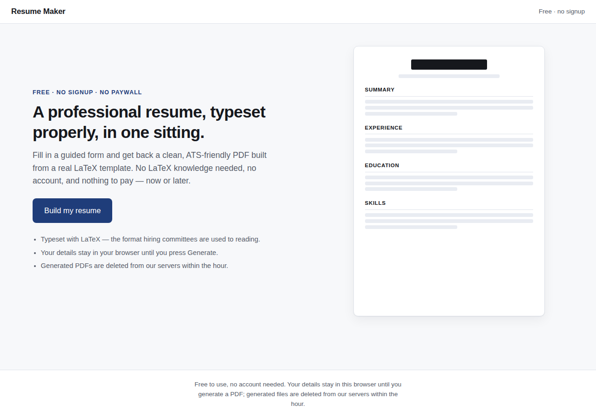
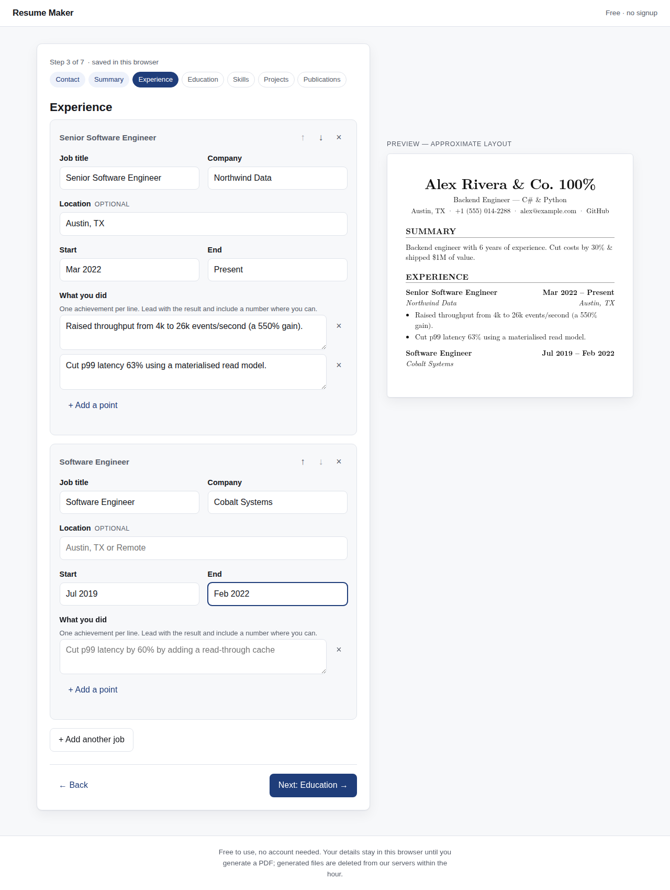
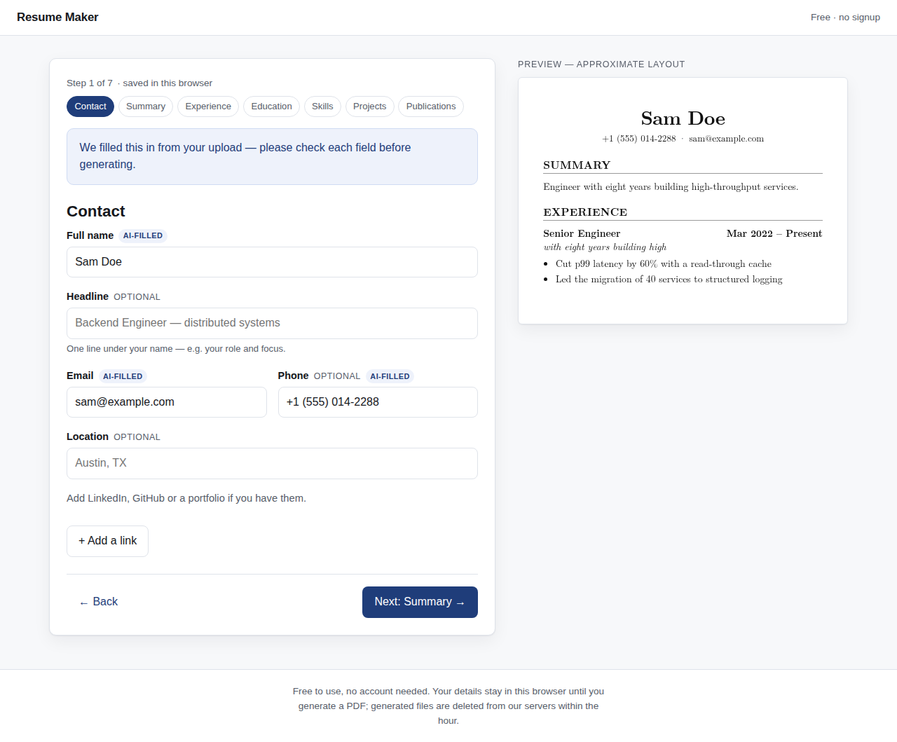
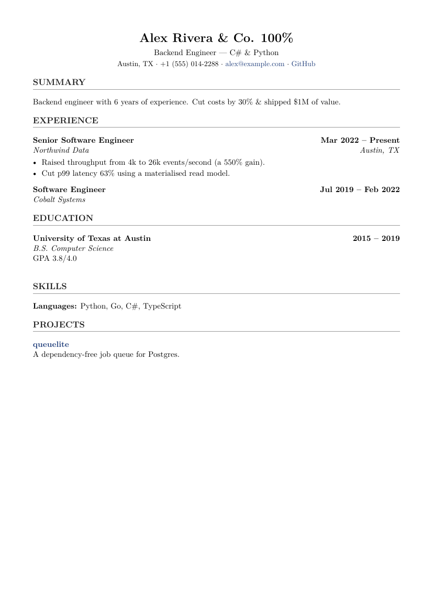

# Resume Maker

A free web app that turns a guided form into a professionally typeset PDF
resume, compiled from a real LaTeX template. No account, no paywall, no LaTeX
knowledge required.

This repository implements **Phase 1** (manual fill, single template, compile
and download) and **Phase 2** (upload an existing resume, AI extraction, review
and edit) of the product plan.

| Landing | Guided form | AI pre-fill | Compiled output |
|---|---|---|---|
|  |  |  |  |

## How it works

```
form input ─┐
            ├→ validate (Pydantic) → escape → render Jinja2 → .tex
upload ─────┘   → queued compile job → sandboxed pdflatex → PDF → short-lived link
  └→ extract text (PDF/DOCX) → LLM → validate → pre-fill the same form
```

The canonical resume schema (`backend/app/schema.py`) sits at the centre: the
form produces it, every template consumes it, and Phase 2's AI extraction will
have to emit it. That's what makes "AI autofill" a pre-fill step rather than a
second pipeline, and what will let Phase 3 re-render existing data into a new
template without retyping anything.

## Running it

### Docker (everything, including the TeX engine)

```bash
docker compose up --build
# web  → http://localhost:8080
# api  → http://localhost:8000
```

### Locally, for development

The backend needs a TeX installation.

**Debian/Ubuntu:**

```bash
sudo apt-get install -y --no-install-recommends \
    texlive-latex-base texlive-latex-recommended texlive-latex-extra \
    texlive-fonts-recommended lmodern poppler-utils
```

**macOS:** `brew install --cask mactex-no-gui && brew install poppler`

**Windows:** install [MiKTeX](https://miktex.org/download) (tick "install
missing packages on the fly") or TeX Live, and make sure `pdflatex --version`
works in a new terminal. Template thumbnails additionally want
[poppler](https://github.com/oschwartz10612/poppler-windows/releases) on
`PATH`; without it the gallery falls back to a link to the sample PDF and
everything else works.

`lmodern` is not optional — without it pdflatex falls back to bitmap fonts,
which look wrong and extract badly in ATS scanners. MiKTeX fetches it
automatically on first compile.

```bash
# API  (Windows: .venv\Scripts\activate, then uvicorn app.main:app --reload --port 8000)
cd backend
python -m venv .venv && .venv/bin/pip install -r requirements-dev.txt
.venv/bin/uvicorn app.main:app --reload --port 8000

# Web
cd frontend
npm install
npm run dev          # http://localhost:5173
```

`GET /api/health` reports what the server actually found — `engine_available`
for LaTeX, `extraction_enabled` for the model providers, and `sandbox` for
which compile protections are in force.

### Previews don't need LaTeX

Two things used to make a cold TeX install painful, and neither does now:

- **The template gallery** serves pre-rendered assets committed to the repo
  (`backend/app/static/previews/`), so browsing templates works with no LaTeX
  installed at all. Regenerate them with `python scripts/build_previews.py`
  after changing a template's layout, and commit the result.
- **The first compile** happens at startup, not in a user's request. A cold
  MiKTeX install downloads packages and builds format files on first run —
  tens of seconds. The warm-up absorbs that and logs how long it took. Set
  `PREWARM_COMPILE=0` to skip it.

The generated PDF is displayed in the page with pdf.js rather than an
`<object>` embed, which depends on the browser shipping a PDF viewer. Users
see the actual typeset output before downloading, on any browser.

#### A caveat about running on Windows

Windows has no `RLIMIT_*`, so on Windows the compiler runs with shell-escape
off and a wall-clock timeout but **without** the memory, CPU and file-size
caps described under Safety. The API logs a warning at startup and
`/api/health` reports `sandbox.resource_limits: false`.

That is fine for local development. For anything reachable from the internet,
run the Docker image (Linux, full limits) or set `COMPILE_BACKEND=docker` so
each compile is isolated in its own throwaway container.

## Tests

```bash
cd backend  && python -m pytest        # 101 tests; compile tests skip if TeX is missing
cd frontend && npm test                # form logic and validation
cd frontend && node e2e/flow.mjs       # manual path, in a real browser
cd frontend && node e2e/upload.mjs     # AI upload path, in a real browser
```

The backend suite compiles deliberately hostile input (`\write18{…}`,
`\end{document}`, `100% & $1M`) all the way to a PDF, because escaping is the
security boundary here, not a formatting nicety.

## API

| Method | Path | Purpose |
|---|---|---|
| `GET` | `/api/health` | Liveness plus which engine is configured |
| `GET` | `/api/templates` | Template catalogue |
| `GET` | `/api/templates/{id}/preview.png` | Sample resume thumbnail |
| `GET` | `/api/templates/{id}/preview.pdf` | Full sample PDF |
| `POST` | `/api/compile` | Enqueue a compile → `202 { job_id }` |
| `POST` | `/api/extract` | Upload a resume for AI extraction → `202 { job_id }` |
| `GET` | `/api/jobs/{job_id}` | `queued` / `running` / `done` / `error` |
| `GET` | `/api/download/{token}` | The generated PDF |

Compilation is asynchronous because it takes seconds and must not block the API
process. `JobQueue` (`backend/app/jobs.py`) is an in-process thread pool shaped
like a task queue; moving to Celery/RQ + Redis means replacing that one module,
not redesigning the API.

## AI extraction (Phase 2)

Upload a PDF or DOCX and the text is sent to an LLM that returns the same
canonical JSON the manual form produces. The user then reviews and edits it in
that form — mandatory, never skipped — before anything compiles.

**Providers and failover.** Free-tier API keys run out, so providers are a
chain, configured as numbered blocks in `backend/.env`:

```
LLM_PROVIDER_1_MODEL=nvidia/nemotron-3-super-120b-a12b
LLM_PROVIDER_1_API_KEY=nvapi-…
LLM_PROVIDER_1_BASE_URL=https://integrate.api.nvidia.com/v1

LLM_PROVIDER_2_MODEL=openai/gpt-oss-20b
LLM_PROVIDER_2_API_KEY=nvapi-…
```

When provider 1 is rate-limited, out of quota, or down (429/402/401/5xx, or a
connection failure), provider 2 serves the request and the user sees nothing.
A 400 does not fail over: that means *we* sent something malformed, and the
next provider would reject it identically. Add `_3`, `_4` blocks to extend the
chain; the endpoints are OpenAI-compatible, so a provider can point at
Anthropic, OpenAI, or a local vLLM without touching code.

Copy `backend/.env.example` to `backend/.env` and add your keys. `.env` is
git-ignored — keep it that way.

**Handling model output.** Replies are stripped of fences and `<think>`
scratchpads, unknown keys are dropped (the schema forbids them, and one
invented field would otherwise discard a good extraction), common shape
mistakes are coerced (a flat skills list, a bullets string, a bare link), and
the result is validated with Pydantic. On a validation failure there is exactly
one repair round that tells the model which fields broke — never quoting their
values.

**Confidence.** A rough completeness score decides whether the review screen
says "check this carefully" more loudly. It is a heuristic, not a probability.

**Verify your keys:**

```bash
cd backend && python scripts/check_llm.py                  # ping each provider
python scripts/check_llm.py path/to/resume.pdf             # full extraction
```

`scripts/fake_llm_server.py` is an OpenAI-compatible stand-in for local work
and for the browser e2e run; `FAKE_LLM_STATUS=429` makes it fail so you can
watch the chain fail over.

## Safety

Every compile runs LaTeX over text an untrusted user supplied, so:

- **Escaping.** Every value reaching a template goes through `escape_latex` —
  enforced by installing it as the Jinja2 environment's `finalize`, so a
  template author cannot forget it. URLs get a narrower escaper that keeps
  `&` and `~` functional inside `\href`.
- **No shell escape.** `-no-shell-escape`, `shell_escape=f`, and
  `openin_any`/`openout_any=p` so the engine cannot read or write outside its
  working directory.
- **Resource limits.** Wall-clock timeout, `RLIMIT_AS`/`CPU`/`FSIZE`/`NPROC`,
  and an ephemeral working directory removed after every job. The rlimits are
  POSIX-only — see the Windows caveat above.
- **Container hardening.** The compose service runs read-only, unprivileged,
  with all capabilities dropped and `no-new-privileges`. Set
  `COMPILE_BACKEND=docker` to isolate each compile in its own `--network=none`
  container instead.
- **Validation before rendering.** Pydantic enforces types, field lengths and
  list caps, and rejects `javascript:`/`file:` URLs, before any text reaches
  the template.
- **No leaking internals.** Users see "something went wrong generating your
  PDF"; the TeX log goes to the server log only, and resume content never does.
- **Uploads.** Type is decided by magic bytes, not the filename; size is capped
  at 5 MB and page count at 10; the bytes are held in memory for the length of
  the job and never written to disk. Prompts, replies and API keys are kept out
  of the logs.

## Privacy

Resume content stays in the browser (`localStorage` autosave) until the user
presses Generate — or, on the upload path, until they choose a file. Uploaded
files are parsed in memory and discarded when the job ends; the extracted text
goes to the configured model provider and nowhere else, which the upload screen
says plainly. Generated PDFs live in a temp store keyed by an unguessable
token and are deleted after `PDF_TTL_SECONDS` (default one hour). Nothing is
persisted server-side beyond that, and there are no accounts to attach it to.

## Configuration

| Variable | Default | Meaning |
|---|---|---|
| `ALLOWED_ORIGINS` | `http://localhost:5173,…` | CORS allow-list |
| `COMPILE_BACKEND` | `subprocess` | `subprocess` or `docker` |
| `LATEX_ENGINE` | `pdflatex` | `pdflatex`, `xelatex` or `tectonic` |
| `COMPILE_TIMEOUT` | `20` | Seconds per compile |
| `COMPILE_MEMORY_MB` | `512` | Address-space cap per compile |
| `COMPILE_WORKERS` | `2` | Concurrent compiles |
| `COMPILE_QUEUE_DEPTH` | `50` | Jobs in flight before returning 503 |
| `RATE_LIMIT_COMPILES` | `10` | Compiles per client per window |
| `RATE_LIMIT_EXTRACTIONS` | `5` | Uploads per client per window (a shared quota) |
| `LLM_PROVIDER_N_*` | — | Provider chain — see AI extraction above |
| `LLM_TIMEOUT` | `120` | Seconds per model call |
| `RATE_LIMIT_WINDOW` | `600` | Rate-limit window, seconds |
| `PDF_TTL_SECONDS` | `3600` | How long a download link works |
| `PREWARM_COMPILE` | `1` | Compile the sample at startup so no user waits for a cold engine |
| `TRUST_PROXY_HEADERS` | unset | Set to `1` only behind a proxy you control |
| `VITE_API_BASE_URL` | `http://localhost:8000` | API origin, baked into the web build |

## Adding a template (Phase 3)

1. Drop a `.tex.j2` file in `backend/app/templates/`, using `\VAR{}` / `\BLOCK{}`
   delimiters against the existing schema.
2. Add one entry to `TEMPLATES` in `backend/app/templates_registry.py`.

The gallery, the form, the compile pipeline and the data model need no changes.

## What's deliberately not here

Still out of scope: accounts, saved drafts on the server, multiple templates
(Phase 3) and payments (never). Scanned/image-only PDFs are detected and
reported rather than OCR'd — a vision model is the better answer there than
bolting on Tesseract, and it is a separate piece of work.

Two implementation notes worth knowing before scaling up:

- The job queue and rate limiter hold state in process memory. They are correct
  for one API process; running several means moving both to Redis.
- Rate limiting is per client IP, which is the right MVP default but is shared
  by everyone behind one NAT.
- Extraction quality is only as good as the configured model. Before trusting
  it, build a small eval set of real resumes with hand-written expected JSON
  and compare providers on it — the code makes swapping them an `.env` change.
